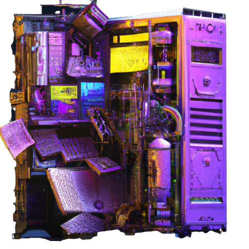

<div align="center">
  
  <br>
</div>

[go-report]: https://goreportcard.com/report/github.com/qsocket/qsocket-relay
[go-report-img]: https://goreportcard.com/badge/github.com/qsocket/qsocket-relay
[release]: https://github.com/qsocket/qsocket-relay/releases
[release-img]: https://img.shields.io/github/v/release/qsocket/qsocket-relay
[downloads]: https://github.com/qsocket/qsocket-relay/releases
[downloads-img]: https://img.shields.io/github/downloads/qsocket/qsocket-relay/total?logo=github
[issues]: https://github.com/qsocket/qsocket-relay/issues
[issues-img]: https://img.shields.io/github/issues/qsocket/qsocket-relay?color=red
[docker-pulls]: https://img.shields.io/docker/pulls/qsocket/qsocket-relay?logo=docker&label=docker%20pulls
[license]: https://raw.githubusercontent.com/qsocket/qsocket-relay/master/LICENSE
[license-img]: https://img.shields.io/github/license/qsocket/qsocket-relay.svg
[workflow-img]: https://github.com/qsocket/qsocket-relay/actions/workflows/main.yml/badge.svg
[workflow]: https://github.com/qsocket/qsocket-relay/actions/workflows/main.yml

The relay server is the back bone of the QSocket project. It is designed for relaying the incoming QSocket connections with high performance and scalability. The official relay instance for the QSocket project `gate.qsocket.io` is available for public use totally free of charge. But we advise everyone to setup their own relays on their own infrastructure. 

## Benchmarks
A single qsr instance with a **2GB RAM** and **1 CPU cores** can handle between **30.000/45.000 simultaneous relay connections**.

## Installation
**The **qsocket-relay** is still in beta stage. The source code will be available with the first major release. It will be directly deployable with heroku, google cloud, and aws.**

[](google-cloud-shell)

| **Tool** |                **Build From Source**                 |      **Docker Image**       | **Binary Release**  |
| :------: | :--------------------------------------------------: | :-------------------------: | :-----------------: |
| **qsr**  | `go install github.com/qsocket/qsocket-relay@latest` | [Download](#docker-install) | [Download](release) |

---

## Usage
```
                                           ________________________________         
                                          /  IN >                          "-_          
                                         /      .  |  .    ヽ༼ຈل͜ຈ༽))>=-       \          
   ༼つಠ益ಠ༽つ ─=≡ΣO))   _        _       /      : \ | / :                       \         
   __ _ ___  ___   ___| | _____| |_    /        '-___-'          ☜(❍ᴥ❍ʋ))>-    \      
  / _` / __|/ _ \ / __| |/ / _ \ __|  /_________________________________________ \      
 | (_| \__ \ (_) | (__|   <  __/ |_        _______| |________________________--""-L 
  \__, |___/\___/ \___|_|\_\___|\__|      /       F J                              \ 
     |_|   Copyright (c) 2022 Qsocket    /       F   J                             L
  https://github.com/qsocket/           /      :'     ':   ─=≡Σ((( つ◕ل͜◕)つ         F
                                       /  OUT < '-___-'                            / 
                                      /_________________________________________--"

Usage: qsr

Flags:
  -h, --help             Show context-sensitive help.
  -c, --config=STRING    Config file in TOML format.
  -d, --logdir=STRING    Log directory.
  -t, --threads=5        Number of threads.
  -q, --quiet            Quiet mode. (no stdout)
  -v, --verbose          Verbose mode.
      --version

```

## QSocket Protocol
QSocket connections are initiated with a **knock sequence**. Knock sequence is 20 bytes long and contains **128bit unique identifier**, **1 byte checksum**, and **3 byte peer identifier**. After establishing a valid TLS connection, relay server expects a knock sequence for starting the QSocket session. 

When the relay server receives a valid knock sequence it first checks the master relay table for the UID of the connecting peer, if the UID does not exists, it is added to the table and the client starts waiting a period of time for incoming relay requests from other peers. If there is a relay request waiting for the client key (UID), relay server creates a full duplex connection between two sockets.
